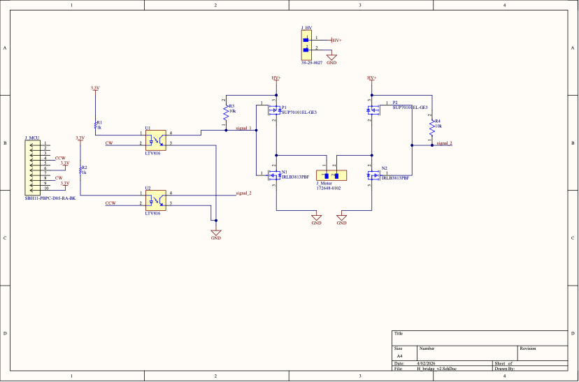
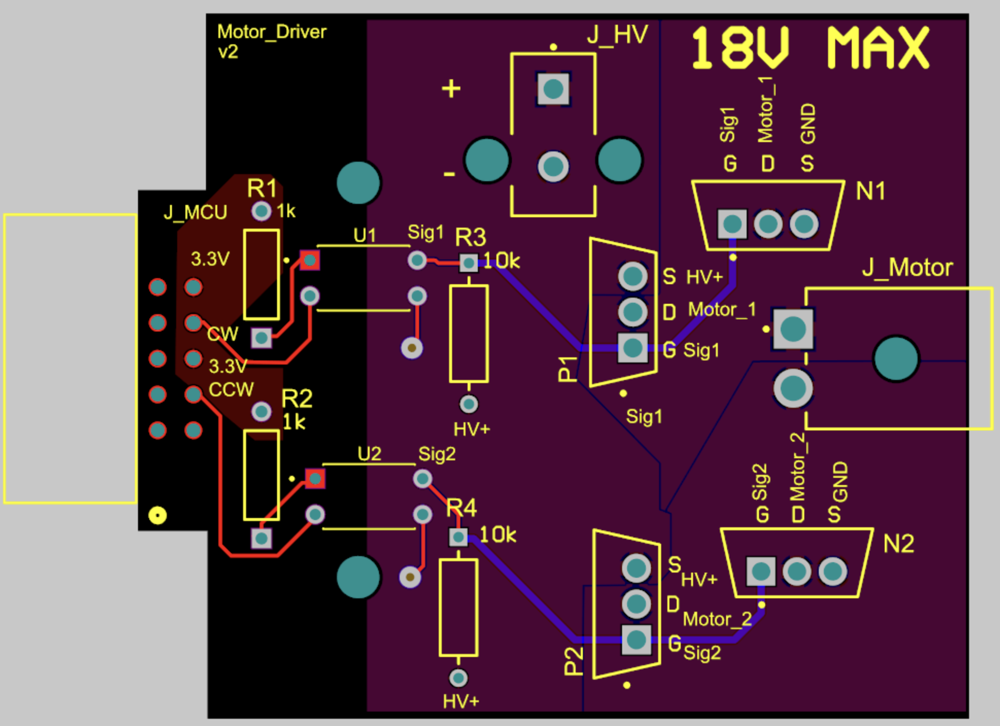
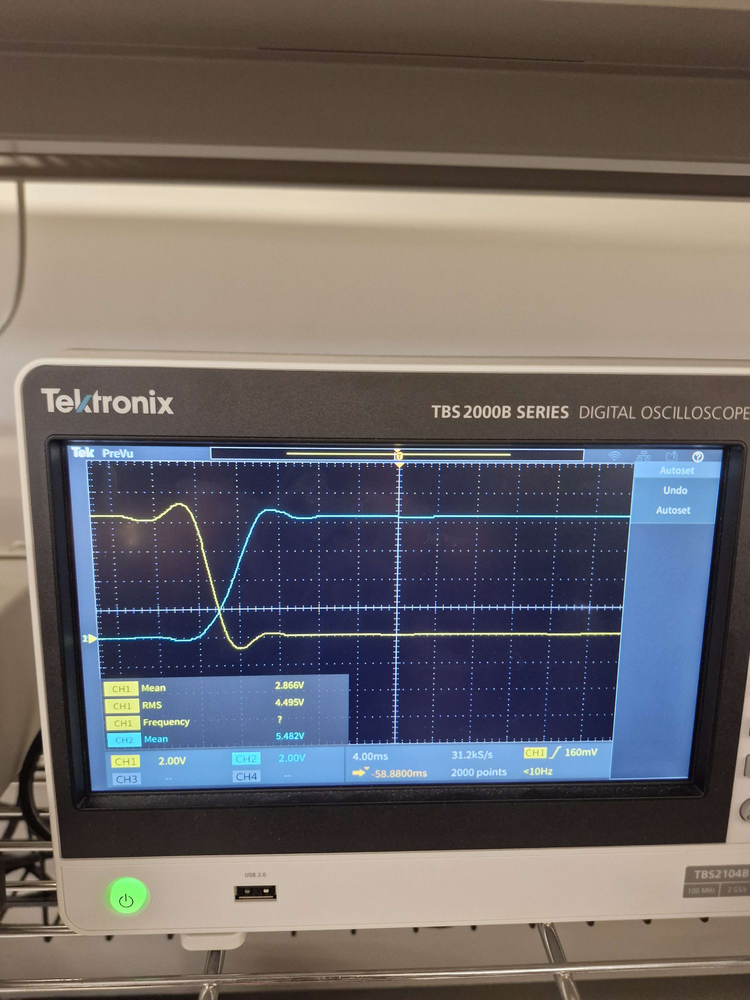
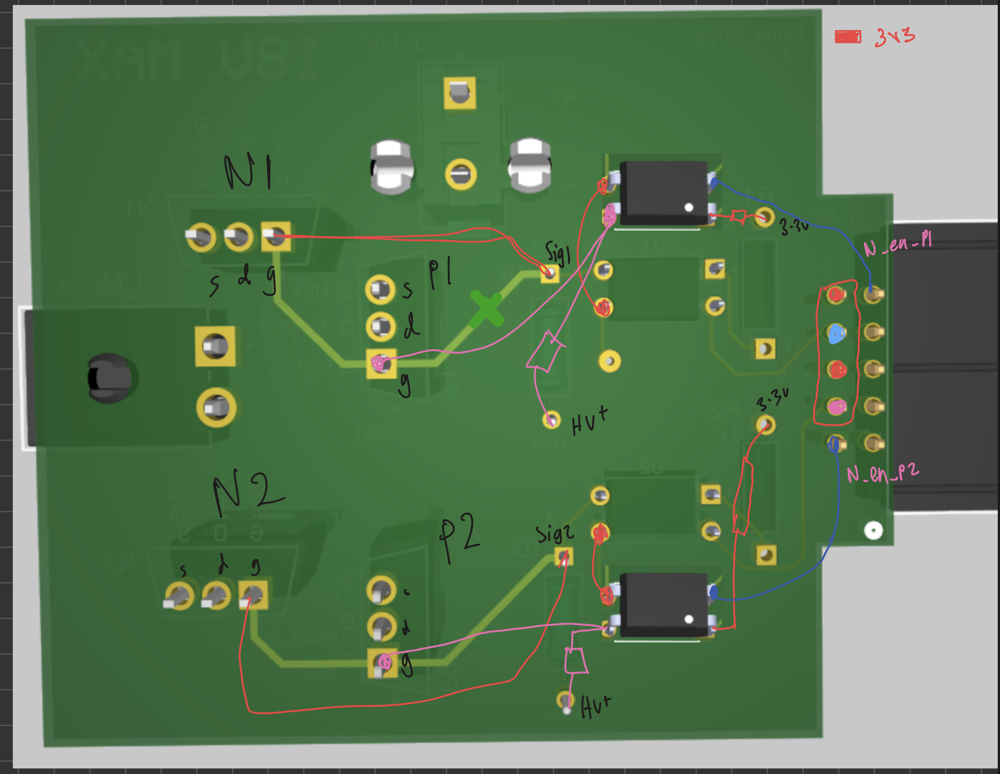
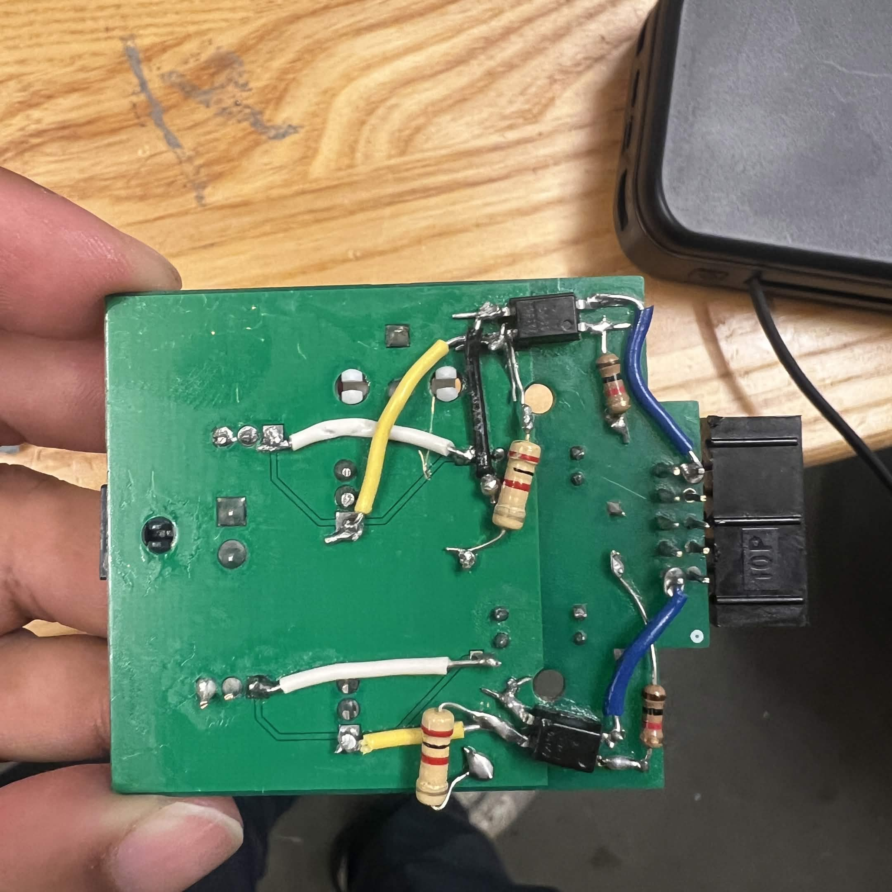
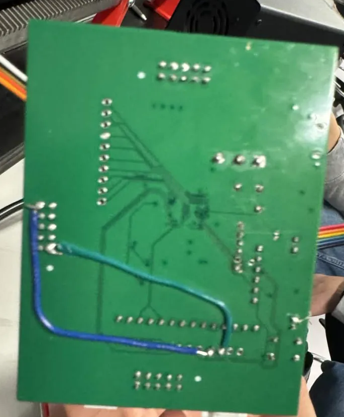
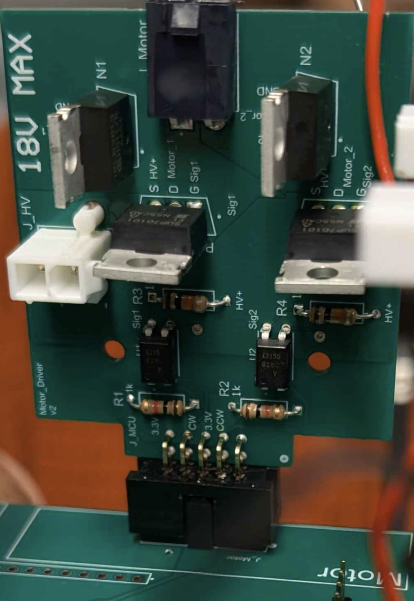
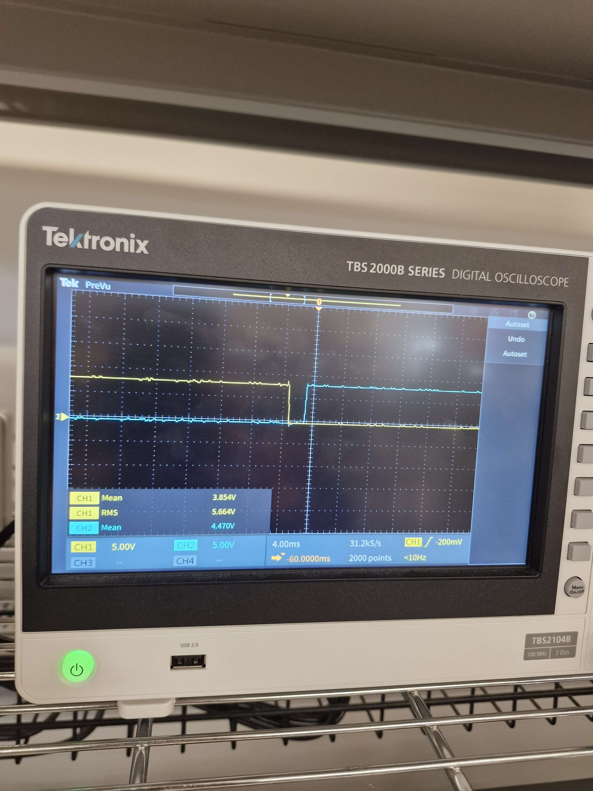

# H-Bridge Motor Driver

This is the motor driver for **Robo Maestro**, a piano-playing robot I built with my team for ELEC 391 (2025W2). It lives on its own daughter board and drives a geared DC motor that slides the robot's hand left and right along the keyboard. A PID loop running on an STM32F446 on the [piano-robot-motherboard](https://github.com/RishiSingh0/piano-robot-motherboard) closes the position loop over this board.

The short version: I designed it, it passed the half-way demo on a bench DC signal, and the first time the control team hit it with real PWM at 10 kHz the MOSFETs started cooking within seconds. The boards were already fabricated, so the fix had to happen on the physical board I already had. The reworked board ran the full song at 20 kHz PWM in the final demo.

---

## The task

My job on the hardware side was an H-bridge the MCU could control to move the robot laterally along the piano. CW would push it right along the keyboard, CCW would push it left, and the PID loop would throw PWM at whichever direction pin it wanted active.

## The board I designed

The design split the MCU side from the motor's HV+ rail and used optocouplers to bridge the two. The MCU sat on the low-voltage 3.3 V side and drove the opto LEDs on the CW and CCW lines; the opto outputs on the HV side did the actual gate drive.

Here are the schematic and layout I sent off to JLCPCB:

One GPIO per leg, through an LTV816 optocoupler, driving **both** the high-side PMOS (SUP70101EL-GE3) and the low-side NMOS (IRLB3813PBF) from the same gate trace. PMOS and NMOS are naturally complementary, so in theory one signal is enough: take the trace high, NMOS on and PMOS off; take it low, PMOS on and NMOS off. Two legs, two opto lines, done. HV+ rail 12–16 V, motor stall 8.5 A, motor connector in the middle.

## The half-way demo passed

For the half-way demo I brought the board up against a bench power supply and tested it the simplest way you can test an H-bridge: hold CW at a 3.3 V DC level on the optocoupler input and watch the motor spin right, then drop CW, assert CCW, and watch it spin left. Motor spun both ways, nothing got hot, and I moved on to integration.

A DC command only transitions once, when you change direction, and a single transition is too brief to cause meaningful heating even if shoot-through is happening on it. The bench test was only checking the steady states on either side of the transition, not the transition itself.

## PWM came in during integration and immediately started frying FETs

During integration, the STM32 started driving the H-bridge's CW and CCW inputs with 10 kHz PWM from TIM1 (channels 1 and 2 on PA8 and PA9). Within seconds the MOSFETs started running hot and burning out.

Because the board had worked at the half-way demo, my first instinct was that something on the software side had gone wrong. Nothing in the hardware had changed, and the only new variable was the waveform coming out of the STM32, so I spent a while digging into the firmware (PWM setup, timer channels, the duty cycle path) and got nowhere. Nothing on the software side actually looked broken. In the meantime we dropped the PWM frequency way down just to see what would happen. The FETs still got hot, just much more slowly, which was itself a clue: whatever was cooking them was happening per switching edge, not per steady-state cycle, so it was pointing at something that scaled with transition rate rather than at a software bug.

So I pivoted back to hardware. I searched for why MOSFETs might run hot under PWM and found articles on **shoot-through current** in H-bridges caused by MOSFET transition times. The idea: if both FETs in a half-bridge are even momentarily on at the same time, there's a dead short from HV+ to GND, and if that happens on every PWM edge you're shorting the supply thousands of times a second. I took that to the scope.

## Confirming it on the scope

I put a Tektronix scope on one half-bridge leg and looked at VGS on both FETs simultaneously:

- Low-side (NMOS): probe directly on the gate, since the source is at GND.
- High-side (PMOS): math channel `CH1 − CH2`, with CH1 on the PMOS gate and CH2 on its source at HV+. You need the difference because the PMOS source floats at HV+, not GND.

Then I fed PWM in and froze the scope on a transition edge:

Both traces X through each other in the middle of every edge. For the duration of that X, both FETs are sitting in their linear regions together and there's a low-resistance path from HV+ through both of them straight to GND. At 10 kHz that's happening on every single PWM edge, which works out to tens of thousands of near-shorts across the supply per second. Exactly what was cooking the FETs.

## Where the slow transition actually comes from

With the failure confirmed on the scope, I went back to the datasheets to work out why the transitions were so slow in the first place.

The LTV816 phototransistor output transition time alone is around 4 µs typical and up to 18 µs worst case. That's already a long edge. On top of that, the shared-gate node on each leg is loaded by both the PMOS and the NMOS input capacitance (Ciss), which for these power FETs is in the multi-nF range each. Call it somewhere around 10–15 nF total hanging off the 10 kΩ pull-up.

That gives an RC time constant somewhere around 100–150 µs, comparable to or longer than the 100 µs PWM period at 10 kHz. The gate can't finish its transition before the next one starts, so both FETs spend a huge fraction of every period sitting in their linear region at the same time. With these parts and this topology, there was no PWM duty cycle that would have actually worked at 10 kHz.

## The constraint I had to design around

The boards were already fabricated and populated. Whatever the fix was, it had to happen on this physical piece of FR4, not a respin.

## The idea I considered and dropped

My first instinct was to add some form of dead-time: either on the firmware side, or with passive components at the gates. I spent a bit of time on this before realising that if I could just give the MCU direct hardware control over when each PMOS is allowed to be on, I wouldn't need dead-time in the first place. The PMOS could only ever be on when the firmware explicitly said so, and the firmware would simply never allow both PMOSes on at once. Software dead-time also had a separate problem: it would have inserted delay into every PWM transition, which would have shown up as tempo drift in the piano playing since the PID is closing a position loop around a moving musical instrument. The hardware enable approach avoids both issues, and that's the direction I went.

## The fix: break the shared gate and give the MCU hardware enables

Instead of trying to shape the existing shared-gate drive, I decided to split it apart and give the MCU **independent** control of each PMOS. Here's the clean schematic of the post-rework topology:

And the handwritten planning sketch from when I was deciding what to cut and where to jump:

The new topology:

1. Cut 4 traces, two per leg (one on the gate-to-gate run between the NMOS and PMOS, one on the signal trace going into the PMOS gate). In hindsight one cut per leg would have been enough, just the signal-to-PMOS-gate trace, and the original front-side optocoupler could have kept driving the NMOS while the new back-side optos drove the isolated PMOS gates. But I did this rework between 1 and 4am and wasn't optimising for minimum cuts; I just wanted the PMOS gate completely off the shared node.
2. Desolder the original 10 kΩ pull-ups (R3, R4) and replace them with 2 kΩ. These resistors sit on the (now NMOS-only) shared node, and the smaller value drops the RC time constant enough for the NMOS gate to track 10+ kHz PWM without the transition-overlap problem.
3. Add 2 new STM32 GPIOs (PB5 and PB6) as dedicated PMOS enables, one per leg.
4. Add 2 new single-channel optocouplers driven by those GPIOs, wired to the now-isolated PMOS gates. Also solder in 2 more 2 kΩ resistors as pull-ups on the new optos' output side so the PMOS gates have a defined state when the enable signal is idle.

The two new optos were soldered **directly onto the back of the existing PCB**. The original LTV816s were through-hole parts, so their pins were already exposed on the back side and I could tap into them with bodge wires. No extra perfboard, no sub-board, just two optos and some wire on the back of the existing board.

Here's what the rework looked like from behind:

And the new enable signal lines being tapped into on the motherboard side:

And reinstalled in the stack:

After the rework, the total signal count into the H-bridge was 4 GPIOs: 2 PWM lines to the NMOSes (unchanged from the original), plus 2 enable lines to the new PMOS-drive optos. The firmware-side logic collapses into a small table:

| State | PMOS_EN_A | PMOS_EN_B | NMOS_A (PWM) | NMOS_B (PWM) |
|---|---|---|---|---|
| Idle / brake | OFF | OFF | OFF | OFF |
| Drive CW | ON | OFF | OFF | PWM |
| Drive CCW | OFF | ON | PWM | OFF |
| Direction change | disable both, then assert the new pair | | | |

On any CW↔CCW transition, the firmware disables both PMOS enables before asserting the opposite pair. No overlap is possible, because the PMOSes can only be ON when the MCU explicitly says so, and the firmware never asserts both enables simultaneously.

The two new optos don't need to be fast either. They're not in the PWM path. They only switch at direction changes, which happen orders of magnitude slower than the PWM frequency, so their multi-µs transition times don't matter.

## After the rework

Back on the scope, same probe setup as before:

Clean non-overlap. One FET is fully off before the other turns on, and there's a clear horizontal gap where neither FET is conducting. No overlap, no shoot-through, no low-resistance path. Same behaviour on both the rising and the falling edge of the switching cycle.

I brought the PWM back up to 10 kHz, then pushed it to **20 kHz for the final demo performance**. The FETs stayed cool at both frequencies, and the robot played the full song end-to-end on the reworked board.

## What I'd do differently

1. **PWM has to be in the very first integration test.** Shoot-through only shows up during a transition, so a DC bench bring-up is structurally incapable of catching it. If you wait until PID integration to introduce PWM, the first time you see the failure is also the first time you're losing FETs.
2. **Don't roll complementary MOSFET drive from a generic optocoupler.** LTV816 transition times (up to 18 µs) are more than an order of magnitude slower than the sub-microsecond edges you need at 10–20 kHz. If I respin this board, I'm using a dedicated half-bridge gate driver IC (IR2184 / IR2110 or similar) with built-in dead-time, or driving each gate independently from the start and adding firmware dead-time explicitly.
3. **Shared-gate drive has no margin.** Using one signal's polarity to turn one FET on and the other off assumes both transitions are identical and instant. Any mismatch shows up as shoot-through.

---

## Files in this repo

- [`schematic/hbridgeV2.pdf`](schematic/hbridgeV2.pdf): the as-fabricated v2 schematic shown at the top of this README (rendered PNG next to the PDF)
- [`schematic/motor_driver_v3.pdf`](schematic/motor_driver_v3.pdf): the post-rework v3 schematic shown in the fix section (rendered PNG next to the PDF)
- [`hardware/`](hardware): Altium source for the fabricated v2 design (schematic, PCB, BOM, project file)
- [`scope/before/`](scope/before) and [`scope/after/`](scope/after): scope captures of VGS on one half-bridge leg before and after the rework
- [`images/`](images): planning sketch, original PCB layout, and photos of the bodged board
- [`notes.txt`](notes.txt): the raw notes I wrote while figuring out the fix, preserved as-is

There's no v3 PCB layout planned; the final demo ran on the reworked v2.

## Related

- Main system repo: [piano-robot-motherboard](https://github.com/RishiSingh0/piano-robot-motherboard)
- Background reading that helped: [AllAboutCircuits: H-bridge dead-time and shoot-through](https://www.allaboutcircuits.com/technical-articles/h-bridge-dc-motor-control-complementary-pulse-width-modulation-pwm-shoot-through-dead-time-pwm/)
